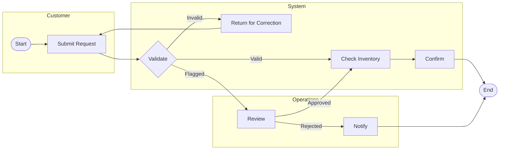
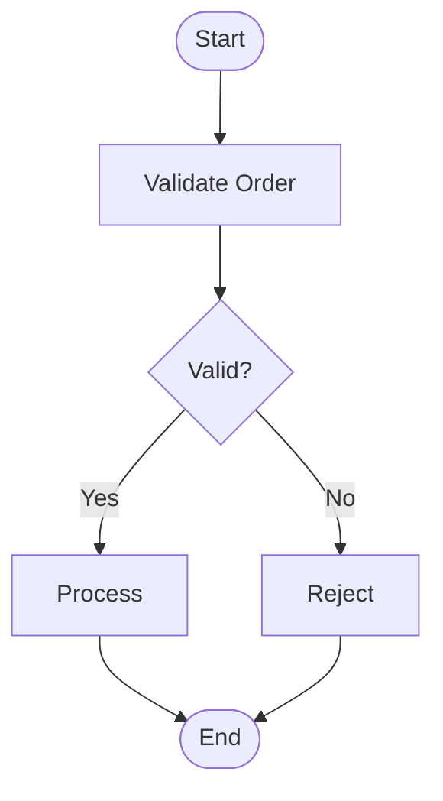
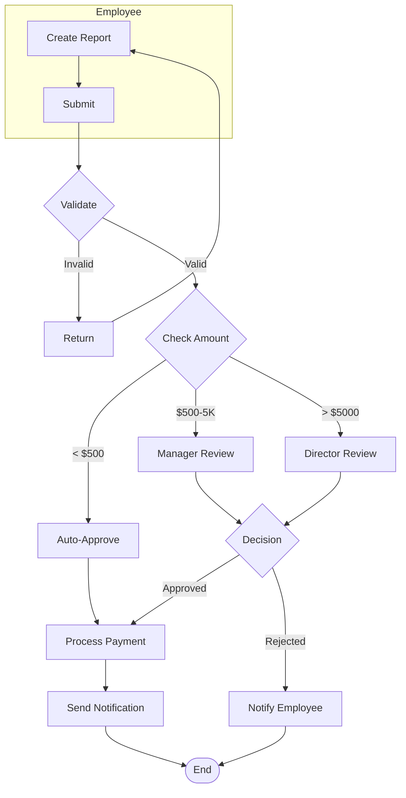

# Feature Specification Skill

Create comprehensive feature descriptions that answer **five critical questions** before development begins:

1. **What is it?** → Function definition and purpose
2. **How to use?** → Usage guide and interaction patterns  
3. **Terms & Regulations?** → Rules, compliance, constraints
4. **Logic behind?** → Algorithms, business rules, state flows
5. **Impact on others?** → Dependencies, side effects, breaking changes

---

## Quick Start

### When to Use This Skill

| Scenario | Use This Skill |
|----------|----------------|
| Planning a new feature | ✅ Write complete spec before dev |
| Handoff from product to engineering | ✅ Document all requirements |
| Refactoring existing feature | ✅ Analyze impact first |
| API/feature deprecation | ✅ Document migration path |
| Compliance-heavy features | ✅ Capture regulations |
| Complex business logic | ✅ Document decision rules |

### Input Format

Provide any of these:
- Feature name + brief description
- User story or requirement
- Problem statement
- Existing PRD that needs expansion

---

## Before You Write

Answer these 5 questions. If you can't, talk to someone before writing.

| Question | Why It Matters |
|----------|----------------|
| What problem does this solve? | Ensures you're building the right thing |
| Who are the users? | Defines scope and personas |
| What's the success criteria? | Gives a clear definition of done |
| What depends on this? | Identifies blockers and prerequisites |
| What's out of scope? | Prevents scope creep |

---

## Phase 2: Feature Specification Structure

Use this template to write the complete feature specification:

```markdown
# Feature Specification: [Feature Name]

**Status:** Draft | Review | Approved  
**Version:** 1.0.0  
**Owner:** [Name]  
**Target Release:** [Sprint/Version]  

---

## 1. What Is It

### 1.1 Function Definition

**One-sentence definition:**  
[This feature enables users to perform X by doing Y, resulting in Z]

**In plain English:**  
[Explain what this feature does as if talking to a non-technical person]

**Scope Boundary:**
| In Scope | Out of Scope |
|----------|--------------|
| [Specific capability] | [Related but excluded] |
| [Specific capability] | [Related but excluded] |

### 1.2 Purpose & Value

**Problem it solves:**  
[What pain point does this address?]

**User value:**  
[How does this make users' lives better?]

**Business value:**  
[Why is this worth investing in?]

### 1.3 User Personas

| Persona | Role | Primary Need | Usage Frequency |
|---------|------|--------------|-----------------|
| [Name] | [Role] | [What they want] | [Daily/Weekly/etc] |

---

## 2. How To Use

### 2.1 Primary User Flow

**Simple Flow (ASCII):**
```
Step 1: [User action]
    ↓
Step 2: [System response + User action]
    ↓
Step 3: [User action]
    ↓
Step 4: [Outcome achieved]
```

**Complex Multi-Actor Flow (BPMN):**
For workflows involving multiple roles, approvals, or parallel paths, use BPMN-style pseudocode:

```
[Customer]        [System]           [Operations]
    |                 |                    |
  start --> "Submit" --> "Validate" ------> "Review"
                         |    |              |
                         |    --------> "Approve"
                         |                    |
                         --------> "Confirm" ---> end
```

Or use Mermaid flowchart for rendering:


### 2.2 Step-by-Step Guide

#### Scenario A: [Primary Use Case]

1. **Navigate to** `[location/page]`
   - Prerequisites: [What must be true first]
   - Expected state: [What user sees]

2. **Trigger the feature** by `[action]`
   - Input: [What user provides]
   - Validation: [What's checked]

3. **System processes** `[what happens behind the scenes]`
   - Processing time: [Expected duration]
   - Feedback: [What user sees while waiting]

4. **Result delivered** as `[output/form]`
   - Success indicator: [How user knows it worked]
   - Output location: [Where result appears]

#### Scenario B: [Alternative Use Case]

[Repeat structure for secondary flows]

### 2.3 Input Specification

| Input Field | Type | Required | Validation | Default |
|-------------|------|----------|------------|---------|
| [Field name] | string/number/etc | Yes/No | [Rules] | [Value] |

### 2.4 Output Specification

| Output | Type | Format | Location |
|--------|------|--------|----------|
| [Output name] | [Type] | [Format] | [Where shown/stored] |

### 2.5 Error Scenarios

| Scenario | User Sees | Recovery Action |
|----------|-----------|-----------------|
| [Error condition] | [Error message] | [How to fix/retry] |

---

## 3. Terms & Regulations

### 3.1 Business Rules

| Rule ID | Rule Statement | Enforced When | Violation Result |
|---------|----------------|---------------|------------------|
| BR-001 | [Specific business constraint] | [Trigger] | [What happens] |
| BR-002 | [Specific business constraint] | [Trigger] | [What happens] |

### 3.2 Terms & Conditions

**Eligibility:**
- Who can use: [User types/roles]
- Prerequisites: [Required conditions]

**Limitations:**
- Rate limits: [If applicable]
- Usage quotas: [If applicable]
- Time restrictions: [If applicable]

**Data Handling:**
- Data collected: [What information is captured]
- Retention period: [How long data is kept]
- Access controls: [Who can view/modify]

### 3.3 Regulatory Compliance

| Regulation | Requirement | Implementation |
|------------|-------------|----------------|
| [GDPR/SOC2/etc] | [Specific requirement] | [How we comply] |

**Privacy Considerations:**
- [ ] PII handling documented
- [ ] User consent requirements noted
- [ ] Data deletion procedures defined
- [ ] Audit trail requirements specified

**Security Requirements:**
- Authentication: [Required level]
- Authorization: [Permission checks]
- Encryption: [In transit/at rest]
- Audit logging: [What is logged]

### 3.4 Legal Constraints

- [ ] Terms of service impact assessed
- [ ] Liability considerations documented
- [ ] Third-party dependencies noted
- [ ] Licensing implications reviewed

---

## 4. Logic Behind

### 4.1 Core Algorithm

**Pseudocode/Logic Flow:**
```
IF [condition A] AND [condition B]:
    PERFORM [action X]
    CALCULATE [value Y] USING [formula]
    RETURN [result Z]
ELSE IF [condition C]:
    PERFORM [action W]
    RETURN [result V]
ELSE:
    RETURN [error state]
```

**Decision Matrix:**

| Condition A | Condition B | Result | Action |
|-------------|-------------|--------|--------|
| True | True | [Outcome] | [Action] |
| True | False | [Outcome] | [Action] |
| False | - | [Outcome] | [Action] |

### 4.2 State Machine

**Simple State Machine (ASCII):**
```
[State A] --[event 1]--> [State B]
    |                       |
[event 2]              [event 3]
    ↓                       ↓
[State C] <---[event 4]-- [State D]
```

**Complex Process Orchestration:**
For backend processes with gateways, events, and parallel flows, use flowchart syntax:



**State Definitions:**

| State | Description | Allowed Transitions |
|-------|-------------|---------------------|
| [State] | [What it means] | [Events that change state] |

### 4.3 Data Transformations

**Input → Output Mapping:**

| Input Value | Transformation | Output Value |
|-------------|----------------|--------------|
| [Input] | [Operation] | [Output] |

**Calculation Rules:**
- Formula: `[mathematical expression]`
- Rounding: [Method]
- Currency handling: [Rules]
- Null handling: [Behavior]

### 4.4 Business Logic Rules

**Priority/Ordering Logic:**
[How are items ordered/prioritized?]

**Aggregation Logic:**
[How are summaries calculated?]

**Filtering Logic:**
[What filters apply and when?]

**Timing Logic:**
- Scheduled operations: [When things run]
- Expiration rules: [When things expire]
- Retry logic: [How failures are handled]

### 4.5 Integration Logic

**Upstream Dependencies:**
```
[External System A] --[data X]--> [This Feature]
[External System B] --[trigger Y]--> [This Feature]
```

**Downstream Effects:**
```
[This Feature] --[action M]--> [System C]
[This Feature] --[event N]--> [System D]
```

---

## 5. Impact Analysis

### 5.1 Dependencies

**This Feature Depends On:**
| Dependency | Type | Impact if Unavailable |
|------------|------|----------------------|
| [System/Feature] | Hard/Soft | [Behavior] |

**Depends On This:**
| Dependent | Impact of Changes |
|-----------|-------------------|
| [System/Feature] | [What breaks/changes] |

### 5.2 Changes Required

| Area | Change | Breaking? |
|------|--------|-----------|
| Database | [Schema/migration] | Yes/No |
| API | [New/modified endpoints] | Yes/No |
| UI | [Components/pages] | Yes/No |
| Config | [New env vars/settings] | Yes/No |

### 5.3 Risks

| Risk | Likelihood | Impact | Mitigation |
|------|------------|--------|------------|
| [Description] | High/Med/Low | High/Med/Low | [Strategy] |

---

## 6. Implementation Notes

### 6.1 Technical Approach

**Architecture:**
[High-level technical approach]

**Key Libraries/Tools:**
- [Library]: [Purpose]

### 6.2 Open Questions

| Question | Blocker? | Who Can Answer |
|----------|----------|----------------|
| [Question] | Yes/No | [Name/Role] |

### 6.3 Assumptions

- [Assumption 1]: [Rationale]
- [Assumption 2]: [Rationale]

### 6.4 Risks

| Risk | Likelihood | Impact | Mitigation |
|------|------------|--------|------------|
| [Risk] | High/Med/Low | High/Med/Low | [Strategy] |

---

## 7. Acceptance Criteria

**Functional:**
- [Specific testable criterion]
- [Specific testable criterion]

**Non-Functional:**
- [Performance/security/UX criterion]
- [Performance/security/UX criterion]

---

## 8. Appendix

### Glossary

| Term | Definition |
|------|------------|
| [Term] | [Meaning] |

### References

- [Link to related docs]
- [Link to designs]
- [Link to API specs]
```

---

## Examples

### Example 1: Payment Processing Feature

```markdown
# Feature Specification: One-Click Payment

## 1. What Is It

**Definition:** One-Click Payment allows returning customers to complete 
purchases using their stored payment method without re-entering card details.

**Scope:**
| In Scope | Out of Scope |
|----------|--------------|
| Stored card payments | Bank transfers |
| Single-click checkout | Subscription billing |
| 3D Secure handling | Cryptocurrency |

## 2. How To Use

**Primary Flow:**
1. Customer clicks "Buy Now" on product page
2. System displays payment confirmation modal with last 4 digits
3. Customer clicks "Confirm Payment"
4. Payment processed, order confirmed

**Input:**
- CVV (required for cards not authenticated within 24h)
- Billing address (if changed since last payment)

## 3. Terms & Regulations

**Business Rules:**
| Rule | Enforcement | Result |
|------|-------------|--------|
| BR-001 | Card must be expired < 1 year | Show error, request new card |
| BR-002 | 3D Secure required > $500 | Trigger authentication flow |
| BR-003 | Max 3 saved cards per user | Show "remove card" prompt |

**PCI Compliance:**
- CVV never stored (transmitted only)
- Card numbers tokenized (Stripe Vault)
- Audit logs retained 7 years

## 4. Logic Behind

**Payment Decision:**
```
IF card_age < 24h AND amount <= 500:
    PROCESS immediate_charge
ELIF card_age >= 24h OR amount > 500:
    REQUIRE cvv_auth OR 3ds_auth
    THEN process_charge
ELSE:
    RETURN error: card_expired
```

## 5. Impact On Other Functions

**Dependencies:**
| System | Impact if Down |
|--------|----------------|
| Stripe API | Fallback to manual entry |
| Fraud Detection | Block high-risk transactions |

**Database Changes:**
- `user_payment_methods` table: Add `last_used_at` timestamp
- `orders` table: Add `payment_method_id` foreign key

**Breaking Changes:**
- Old `/checkout` endpoint deprecated → Migration: Use `/v2/checkout`
```

### Example 2: Content Moderation Feature

```markdown
# Feature Specification: Auto-Content Moderation

## 1. What Is It

AI-powered content moderation that automatically reviews user-generated 
content and flags violations before publication.

## 2. How To Use

**Content Submission Flow:**
1. User submits content (post/comment/image)
2. System runs AI moderation scan (async, < 2s)
3. Result returned: APPROVED / FLAGGED / BLOCKED

## 3. Terms & Regulations

**Community Guidelines Enforcement:**
| Violation Type | Action | Appeal Allowed |
|----------------|--------|----------------|
| Hate speech | Block + Warning | Yes |
| Spam | Shadow ban | No |
| Copyright | Hold for review | Yes |

**GDPR Compliance:**
- User can request human review (Art. 22)
- Decision explanation provided
- False positive data used for model retraining (opt-in)

## 4. Logic Behind

**Moderation Pipeline:**
```
Content In → Text Analysis → Image Analysis → Risk Score
                                      ↓
            [Score < 0.3] → APPROVED → Publish
            [0.3 <= Score < 0.8] → FLAGGED → Human Review
            [Score >= 0.8] → BLOCKED → User Notification
```

**Escalation Rules:**
- Reported content: Bypass score, go to human review
- Trusted users: Threshold +0.2 (more lenient)
- New accounts: Threshold -0.1 (stricter)

## 5. Impact On Other Functions

**Affected Systems:**
- User notifications: New "Content Blocked" template
- Analytics: New "Moderation Actions" events
- Admin dashboard: New review queue section

**Performance Impact:**
- 500ms added to publish flow
- CDN caching adjusted for pending content
```

### Example 3: Approval Workflow (with BPMN)

```markdown
# Feature Specification: Expense Approval Workflow

## 1. What Is It

**Definition:** Multi-stage expense approval system routing requests 
based on amount thresholds and department hierarchy.

## 2. How To Use

**Process Flow:**



## 3. Terms & Regulations

**Business Rules:**
| Rule | Condition | Action |
|------|-----------|--------|
| BR-001 | Amount < $500 | Auto-approved, manager notified |
| BR-002 | Amount $500-$5000 | Direct manager approval required |
| BR-003 | Amount > $5000 | Department director approval required |
| BR-004 | Missing receipts | Auto-return to employee |
| BR-005 | Approval timeout (48h) | Escalate to next level |

## 4. Logic Behind

**Routing Decision Matrix:**

| Amount | Receipts Valid | Department | Route |
|--------|----------------|------------|-------|
| $0-$499 | Yes | Any | Auto-approve |
| $500-$4999 | Yes | Any | Manager queue |
| $5000+ | Yes | Any | Director queue |
| Any | No | Any | Return to employee |

**Escalation Logic:**
```
IF approval_pending_time > 48h:
    IF current_approver == manager:
        ESCALATE_TO director
    ELIF current_approver == director:
        ESCALATE_TO finance_head
    NOTIFY original_approver of escalation
```

## 5. Impact Analysis

| Area | Change | Breaking? |
|------|--------|-----------|
| Notifications | New templates: Approved, Rejected, Escalation | No |
| Finance API | New webhook: `expense.approved` | No |
| Mobile App | Push notifications added | No |
```

---

## Output

Save to: `docs/specs/[feature-name]-spec.md`

Share with: Product Manager, Engineering Lead, QA Lead

---

## Tips for Great Specifications

### DO ✅
- Write for an engineer who's never seen this feature before
- Include specific examples, not just abstract descriptions
- Document the "why" behind business rules
- Call out non-obvious edge cases
- Be explicit about what's NOT included
- Use diagrams for complex flows
- Use **flowchart diagrams** for complex multi-actor workflows

### DON'T ❌
- Skip the impact analysis "because it's obvious"
- Use vague terms like "appropriate" or "reasonable"
- Assume compliance requirements are "standard"
- Forget to document error scenarios
- Leave dependencies implicit

---

## Summary

This skill produces specifications that answer:

| Question | Section | Why It Matters |
|----------|---------|----------------|
| What is it? | Section 1 | Alignment on scope |
| How to use? | Section 2 | UX clarity |
| Terms & regulations? | Section 3 | Compliance, rules |
| Logic behind? | Section 4 | Implementation guide |
| Impact on others? | Section 5 | Risk assessment |

---

*"A complete specification prevents surprises during development."*
